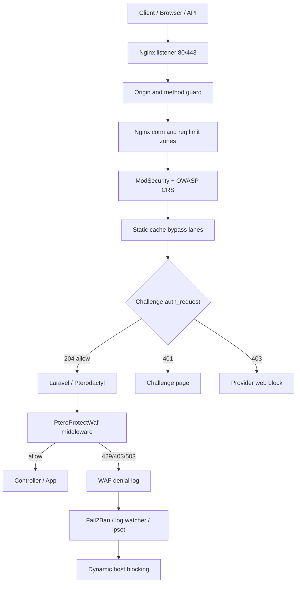
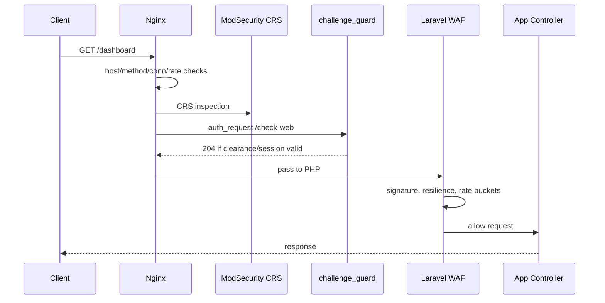
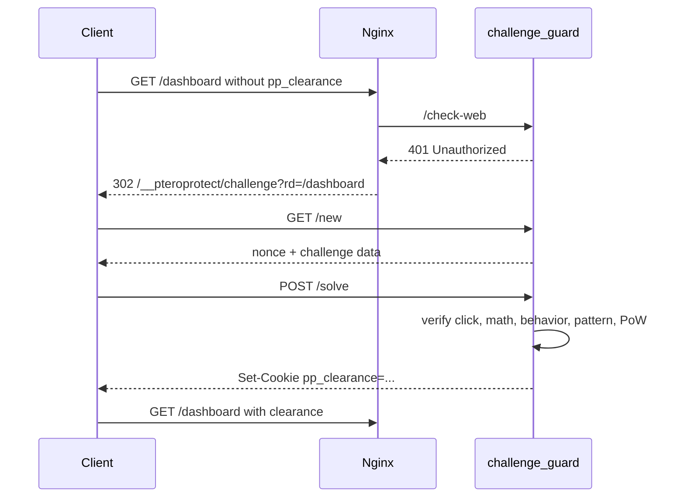
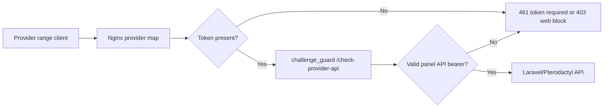
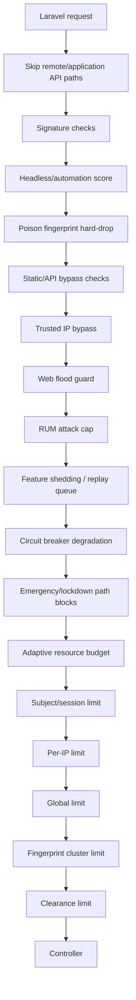
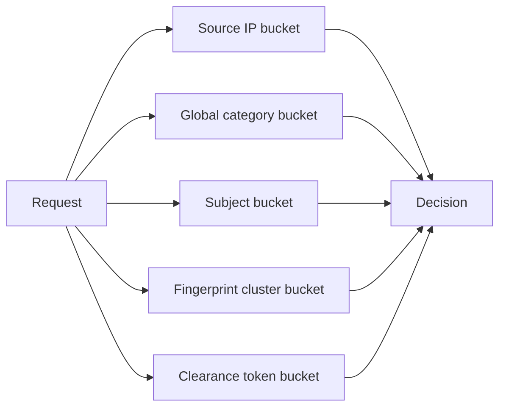
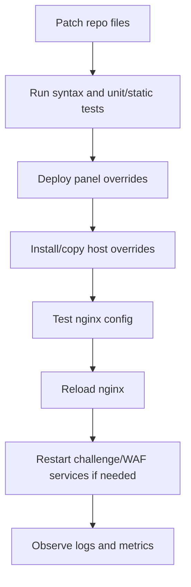

# PteroProtect WAF and Anti-DDoS Architecture

This document explains how the PteroProtect WAF stack works, what was upgraded in this pass, and how requests move through the protection layers. It is written from the current repository state and focuses on the files that actually enforce WAF, challenge, rate limiting, logging, and mitigation behavior.

## Scope Read

The review covered these WAF and anti-DDoS surfaces:

- `host_overrides/nginx/sites-available/pterodactyl.conf`
- `host_overrides/nginx/snippets/pteroprotect_server.conf`
- `host_overrides/nginx/conf.d/pteroprotect_http_zones.conf`
- `host_overrides/nginx/conf.d/pteroprotect_realip.conf`
- `host_overrides/nginx/conf.d/pteroprotect_provider_gate.conf`
- `host_overrides/nginx/modsec/main.conf`
- `host_overrides/nginx/modsec/crs-setup.conf`
- `host_overrides/nginx/modsec/local-exclusions.conf`
- `host_overrides/fail2ban/jail.d/pteroprotect.local`
- `host_overrides/fail2ban/filter.d/*.conf`
- `panel_overrides/app/Http/Middleware/Security/PteroProtectWaf.php`
- `panel_overrides/config/pteroprotect.php`
- `panel_overrides/app/Support/Security/PteroProtectClearanceToken.php`
- `scripts/pteroprotect_challenge_api.py`
- `src/challenge_guard.cpp`
- `scripts/resilience_runtime.py`
- `scripts/security_log_watch.py`
- `scripts/ddos_host_logger.sh`
- `scripts/security_startup_policy.py`
- `tests/test_modsecurity_config.py`
- `tests/test_waf_hardening_static.py`
- `tests/test_rate_protect.py`

## High-Level System



The system is layered. Nginx handles cheap protocol and rate decisions first. ModSecurity handles CRS inspection. The challenge guard handles browser clearance and provider API checks. Laravel then applies application-aware decisions that need sessions, users, resilience state, and request semantics.

## What Was Updated

### 1. Nginx rate zones were reduced

File: `host_overrides/nginx/conf.d/pteroprotect_http_zones.conf`

The old defaults were high enough that a small bot set could push significant traffic through the origin before Laravel made a decision. The new defaults reduce baseline request rates:

```nginx
limit_req_zone $pteroprotect_rate_key zone=pteroprotect_auth:16m rate=10r/s;
limit_req_zone $pteroprotect_rate_key zone=pteroprotect_req:32m rate=30r/s;
limit_req_zone $pteroprotect_rate_key zone=pteroprotect_auth_global_req:16m rate=20r/s;
limit_req_zone $pteroprotect_rate_key zone=pteroprotect_ws_req:16m rate=40r/s;
limit_req_zone $pteroprotect_rate_key zone=pteroprotect_api_key_req:32m rate=120r/s;
limit_req_zone $server_name zone=pteroprotect_api_global_req:16m rate=600r/s;
limit_req_zone $pteroprotect_rate_key zone=pp_req_burst:32m rate=60r/s;
```

File: `setup.sh`

The installer rate normalization was updated so deploy does not raise these lower rates back to the old minimums.

### 2. ModSecurity profile exemption no longer uses broad `allow`

File: `host_overrides/nginx/modsec/local-exclusions.conf`

The profile/avatar route previously used a broad ModSecurity `allow`, which can short-circuit later checks. It now only removes the known anomaly summary rule:

```apache
SecRule REQUEST_URI "@rx ^/api/client/account/profile(?:/avatar)?$" \
  "id:100103,phase:1,pass,nolog,ctl:ruleRemoveById=949110"
```

Reasoning: normal authenticated profile updates can trip CRS anomaly summary rule `949110`, but there is no need to disable all subsequent ModSecurity processing.

### 3. Proxy header trust is now explicit

Files:

- `panel_overrides/app/Http/Middleware/Security/PteroProtectWaf.php`
- `panel_overrides/config/pteroprotect.php`

Before, the Laravel WAF treated private/reserved source addresses as proxy sources for spoof-header analysis. That is risky in private networks because a direct client from RFC1918 space could send `X-Forwarded-For` or `CF-Connecting-IP` and look proxy-like.

The new behavior trusts:

- Loopback
- Configured `PTEROPROTECT_WAF_TRUSTED_PROXY_CIDRS`
- Known Cloudflare CIDRs
- Private proxy ranges only when `PTEROPROTECT_WAF_TRUST_PRIVATE_PROXY_RANGES=true`

This matches the rule: never block or allow solely because of mutable forwarded headers unless the proxy chain is defined.

### 4. Application WAF gained method/header/cookie abuse checks

Files:

- `panel_overrides/app/Http/Middleware/Security/PteroProtectWaf.php`
- `panel_overrides/config/pteroprotect.php`

New checks reject suspicious requests before expensive application work:

- HTTP method allow-list
- Maximum header count
- Maximum header name length
- Maximum header value length
- Maximum cookie count
- Maximum raw Cookie header bytes

Current config keys:

```php
'allowed_methods' => ['GET', 'HEAD', 'POST', 'PUT', 'PATCH', 'DELETE', 'OPTIONS'],
'max_header_count' => env('PTEROPROTECT_WAF_MAX_HEADER_COUNT', 80),
'max_header_name_length' => env('PTEROPROTECT_WAF_MAX_HEADER_NAME_LENGTH', 80),
'max_header_value_length' => env('PTEROPROTECT_WAF_MAX_HEADER_VALUE_LENGTH', 8192),
'max_cookie_count' => env('PTEROPROTECT_WAF_MAX_COOKIE_COUNT', 40),
'max_cookie_bytes' => env('PTEROPROTECT_WAF_MAX_COOKIE_BYTES', 8192),
```

Why this matters: a request can be cheap for the sender but expensive for PHP if it carries excessive headers, huge cookies, or unusual methods. These checks stop that before controller code runs.

### 5. Application WAF gained subject/session rate buckets

Files:

- `panel_overrides/app/Http/Middleware/Security/PteroProtectWaf.php`
- `panel_overrides/config/pteroprotect.php`

The system already had IP, global, fingerprint, and clearance buckets. It now also has a subject bucket:

```text
user ID -> valid clearance token -> Laravel session cookie
```

Bucket names are hashed before being used in Laravel's `RateLimiter`.

This improves NAT behavior. A shared IP can contain both real users and abusive sessions. Per-IP limiting protects the origin, but subject limiting gives the WAF a way to cap one authenticated session without immediately punishing every user behind the same network.

### 6. Nginx drops TRACE and bounds slow headers

File: `host_overrides/nginx/snippets/pteroprotect_server.conf`

Added:

```nginx
if ($request_method = TRACE) { return 444; }
client_header_timeout 8s;
```

`CONNECT` was already dropped. `TRACE` is now also dropped. `client_header_timeout` reduces exposure to slow-header attacks before the request reaches PHP.

### 7. Startup policy detects reused control secrets

File: `scripts/security_startup_policy.py`

The startup policy now warns if one control secret is reused across multiple control roles:

- `network.waf_challenge_secret`
- `network.unblock_portal_token`
- `network.rce_control_key`
- `network.emergency_control_token`
- `network.node_auth_key`

This does not treat an exposed config file as the issue. It checks operational quality: independent controls should not share the same credential.

### 8. Tests were added or strengthened

Files:

- `tests/test_modsecurity_config.py`
- `tests/test_waf_hardening_static.py`
- `tests/test_rate_protect.py`

The tests now assert:

- ModSecurity remains enabled.
- CRS is still included.
- Challenge and terminal exclusions remain scoped.
- The profile/avatar route does not reintroduce broad `allow`.
- WAF includes method, header, cookie, and subject buckets.
- Nginx drops `TRACE`.
- Slow header timeout is present.

## Request Workflows

### Normal browser request



### First browser visit without clearance



### Provider-gated API request



Provider gating is split between Nginx maps and challenge guard validation. The challenge guard checks whether a provider source must present a token and verifies panel API bearer credentials when required.

### Application WAF decision order



This order intentionally puts cheap deterministic checks before rate limit counters, and resilience decisions before normal traffic buckets.

## Layer Model

```text
Layer 3/4: ipset, iptables, connection state, SYN/established counts
Layer 7 edge: Nginx host/method/timeouts, conn limits, req limits
Layer 7 WAF: ModSecurity + OWASP CRS
Browser gate: challenge_guard auth_request, clearance cookie, provider token checks
Application WAF: Laravel semantic decisions and session-aware throttles
Runtime adaptation: resilience state, poison fingerprints, feature shedding, replay queue
Operational enforcement: Fail2Ban, security_log_watch, ddos_host_logger dynamic ipsets
```

## How Each Layer Works

### Nginx

Primary files:

- `host_overrides/nginx/sites-available/pterodactyl.conf`
- `host_overrides/nginx/snippets/pteroprotect_server.conf`
- `host_overrides/nginx/conf.d/pteroprotect_http_zones.conf`

Responsibilities:

- Disable server tokens.
- Hide origin IP probe endpoints with opaque `unknown` responses.
- Drop literal-IP host header requests.
- Drop `CONNECT` and `TRACE`.
- Enforce connection limits.
- Enforce per-source request limits.
- Apply `auth_request` to challenge endpoints.
- Send normal traffic to Laravel.
- Serve static assets through bypass/cache lanes.

Important behavior:

- `limit_req_status 429` and `limit_conn_status 429` normalize limit responses.
- `error_page 429 = @pteroprotect_waf_ratelimit` returns a user-facing WAF rate-limit page.
- Challenge auth requests use short upstream timeouts and fail closed with `503`.

### ModSecurity and OWASP CRS

Primary files:

- `host_overrides/nginx/modsec/main.conf`
- `host_overrides/nginx/modsec/crs-setup.conf`
- `host_overrides/nginx/modsec/local-exclusions.conf`

Responsibilities:

- Enable request body inspection.
- Keep response body inspection disabled for performance.
- Cap request body and PCRE limits.
- Include OWASP CRS.
- Apply scoped local exclusions for high-noise routes.

Current local exclusion approach:

- API JSON remains parsed as JSON.
- SQLi/RCE/LFI targets are narrowed for noisy Pterodactyl API fields.
- Challenge solve/check traffic removes only noisy rule classes.
- Terminal traffic removes SQLi/RCE noise because terminal bytes are protected by admin auth and tickets.
- Profile/avatar removes only `949110`, not the whole CRS path.

### challenge_guard

Primary files:

- `src/challenge_guard.cpp`
- `scripts/pteroprotect_challenge_api.py`
- `panel_overrides/app/Support/Security/PteroProtectClearanceToken.php`

The C++ `challenge_guard` is the stronger runtime implementation. The Python challenge API is a simpler compatible helper.

Responsibilities:

- Answer Nginx `auth_request` checks.
- Issue signed clearance cookies.
- Bind clearance to IP prefix, user-agent fingerprint, session ID, and optional session cookie fingerprint.
- Allow limited mobile IP rotation for the same session.
- Rate limit expensive challenge endpoints.
- Validate panel API bearer tokens for provider-gated API paths.
- Block web access from configured provider ranges when provider gate is enabled.
- Emit structured security events.

Clearance model:

```text
payload = base64url(JSON claims)
signature = HMAC-SHA256(secret, payload)
token = payload.signature
```

Important claims:

- `ip`
- `ip_prefix`
- `ua_fp`
- `sid`
- `sid_fp`
- `iat`
- `exp`
- `iss`
- `jti`

The Laravel helper validates these tokens locally when the challenge secret is available. If not, it can ask the challenge guard.

### Laravel PteroProtectWaf

Primary files:

- `panel_overrides/app/Http/Middleware/Security/PteroProtectWaf.php`
- `panel_overrides/config/pteroprotect.php`

Responsibilities:

- Classify path into `auth`, `websocket`, `resource`, `api`, or `web`.
- Reject obvious bad request shapes.
- Detect spoofed forwarding headers.
- Detect malformed Host headers.
- Detect automation/headless indicators.
- Read resilience state, feature flags, budgets, circuits, and poison fingerprints.
- Shed non-critical routes under pressure.
- Queue replay tickets during constrained/emergency states.
- Apply per-subject, per-IP, global, fingerprint, and clearance rate limits.
- Log high-confidence decisions to `/dev/shm/pteroprotect/waf.log`.

The important design choice is that Laravel WAF makes semantic decisions. It knows route categories, authenticated users, sessions, app state, and recovery state. That is why it complements Nginx rather than replacing it.

### Resilience State

Primary files:

- `scripts/resilience_runtime.py`
- runtime files under `/pteroprotect/runtime`

The resilience system exposes state to the Laravel WAF:

- `normal`
- `elevated`
- `constrained`
- `emergency`

The WAF consumes:

- Feature shedding flags
- Replay queue configuration
- Resource governor budgets
- Circuit breaker states
- Poison fingerprints

This lets WAF behavior change during real pressure. Example: under constrained state, non-critical APIs can be deferred or shed while core auth and control paths remain available.

### Fail2Ban and Host Blocking

Primary files:

- `host_overrides/fail2ban/jail.d/pteroprotect.local`
- `host_overrides/fail2ban/filter.d/*.conf`
- `scripts/security_log_watch.py`
- `scripts/ddos_host_logger.sh`

Responsibilities:

- Convert repeated high-confidence WAF denies into bans.
- Detect auth abuse from Nginx access logs.
- Detect SQLi probes from the SQLi log.
- Detect Wings/API abuse statuses.
- Manage dynamic ipsets.
- Track heavy hitters and attack rules.
- Write runtime mode/lockdown state for panel and host components.

Fail2Ban intentionally does not ban all `429` responses. That avoids punishing normal users during rate-limit pressure. It focuses on high-confidence reasons such as `signature` and `headless-stealth`.

## Updated Control Matrix

| Risk | Control | Layer | Updated |
| --- | --- | --- | --- |
| Header spoofing | Explicit proxy CIDR trust | Laravel WAF | Yes |
| Huge headers | Header count/name/value caps | Laravel WAF | Yes |
| Cookie bloat | Cookie count/raw byte cap | Laravel WAF | Yes |
| Bad methods | HTTP method allow-list, Nginx TRACE drop | Nginx + Laravel | Yes |
| Profile CRS false positive | Remove only CRS `949110` | ModSecurity | Yes |
| Small L7 floods | Lower Nginx request rates | Nginx | Yes |
| NAT/shared IP abuse | Subject/session rate buckets | Laravel WAF | Yes |
| Slow header reads | `client_header_timeout 8s` | Nginx | Yes |
| Reused control credentials | startup warning | Startup policy | Yes |

## Rate Limiting Strategy



Identity keys:

- Nginx: `$binary_remote_addr` via `$pteroprotect_rate_key`.
- Laravel per-IP: raw `Request::ip()`.
- Laravel subject: user ID, valid clearance token, or Laravel session cookie.
- Laravel fingerprint: method, normalized path, user-agent, language, encoding, client hints, fetch metadata, DNT, upgrade header.
- Laravel clearance: valid clearance token plus IP and UA.

Why multiple buckets:

- Per-IP protects the origin from one source.
- Global protects the service when many sources are involved.
- Subject protects shared NATs from one abusive session.
- Fingerprint catches many hosts running the same tool pattern.
- Clearance limits preserve the value of the challenge token after it is issued.

## Failure Modes

| Component failure | Current behavior |
| --- | --- |
| challenge_guard unavailable | Nginx auth_request maps upstream errors to challenge deny / `503` |
| ModSecurity false positive | Local exclusions are scoped and test-covered |
| Redis/cache issue | Laravel RateLimiter behavior depends on configured cache driver |
| Resilience state missing | WAF treats stage as `normal` and continues |
| Poison file missing | Poison hard-drop is skipped |
| Fail2Ban unavailable | WAF still blocks in-process, but long bans may not apply |
| Nginx reload not applied | Template changes exist, but live host still needs deployment/reload |

## Validation

Commands run for this upgrade:

```bash
php -l panel_overrides/app/Http/Middleware/Security/PteroProtectWaf.php
php -l panel_overrides/config/pteroprotect.php
python3 tests/test_waf_hardening_static.py
python3 tests/test_modsecurity_config.py
python3 tests/test_rate_protect.py
bash -n setup.sh
```

Expected outputs:

- PHP syntax checks report no syntax errors.
- `waf hardening static tests ok`
- `modsecurity config tests ok`
- `rate_protect tests ok`
- `bash -n setup.sh` exits with status `0`.

## Deployment Workflow



Recommended checks after deployment:

```bash
nginx -t
systemctl reload nginx
systemctl restart pteroprotect-challenge
tail -f /dev/shm/pteroprotect/waf.log
tail -f /var/log/nginx/pteroprotect.access.log
fail2ban-client status pteroprotect-waf-deny
```

## Rollback Plan

If normal users are blocked unexpectedly:

1. Temporarily raise WAF thresholds in `panel_overrides/config/pteroprotect.php` or the deployed panel config cache.
2. Disable subject buckets with `PTEROPROTECT_WAF_SUBJECT_LIMIT_ENABLED=false`.
3. Raise Nginx zones in `pteroprotect_http_zones.conf`, then run `nginx -t` and reload.
4. Remove only the latest specific local exclusion if ModSecurity is the cause.
5. Flush only the bad dynamic block, not the whole firewall, unless the host is inaccessible.

Useful commands:

```bash
nginx -t
systemctl reload nginx
fail2ban-client status
ipset list pteroprotect_block_v4
ipset del pteroprotect_block_v4 <ip>
```

## Operational Metrics to Watch

Watch these signals before and after tuning:

- `429` rate from Nginx access logs.
- `403` WAF signature blocks.
- `401` challenge redirects.
- Challenge solve success rate.
- `/dev/shm/pteroprotect/waf.log` deny reasons.
- `/pteroprotect/runtime/resilience_state.json` stage.
- Fail2Ban jail counts.
- ipset block counts.
- PHP-FPM active/slow requests.
- Nginx upstream timeout and 5xx counts.

## Tuning Guidance

Start conservative, then use logs to tune:

- If many real users hit `429` on static routes, static/cache bypass lanes or Nginx static rate should be revisited.
- If shared networks get blocked, prefer subject/session buckets over lowering per-IP thresholds further.
- If challenge loops appear, inspect `session_mismatch`, `ip_prefix_miss`, `ua_miss`, and cookie `Secure` mode.
- If ModSecurity blocks normal API payloads, add targeted `ctl:ruleRemoveTargetByTag` or `ctl:ruleRemoveById`; avoid broad `allow`.
- If attack traffic is distributed, global and fingerprint buckets matter more than per-IP buckets.
- If attack traffic is from hosting/provider ranges, enable provider token gate and keep web traffic blocked for those ranges.

## Design Notes

The main design principle is staged cost:

```text
Drop the cheapest bad traffic earliest.
Challenge ambiguous browser traffic before PHP.
Use application context only after protocol and CRS checks.
Escalate repeated high-confidence abuse into host-level blocking.
Keep false-positive escape hatches targeted and test-covered.
```

This is why the system uses Nginx, ModSecurity, challenge guard, Laravel middleware, resilience state, and Fail2Ban together instead of relying on one control.

## Current Known Tradeoffs

- `/api/remote` and `/api/application` bypass the Laravel WAF middleware early for compatibility. They still need equivalent Nginx/challenge/provider-token controls.
- Fingerprint clustering is powerful but can false-positive on shared clients, so it remains configurable.
- Cloud/CDN real IP restoration is disabled unless trusted proxy CIDRs are configured.
- Challenge clearance intentionally allows limited mobile IP rotation to reduce false challenge loops.
- Host-level ipset bans are strong controls and should be driven by high-confidence events, not raw `429` volume alone.

